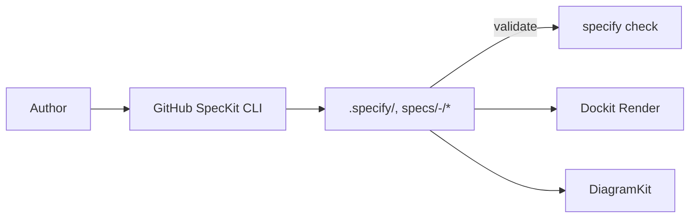

# SpecKit Wrapper — Specification One-Pager

## Problem & Intended Outcome

Teams need a consistent, auditable, spec‑first flow. This wrapper standardizes GitHub’s SpecKit runs across agents, validates prerequisites/structure, and exposes a thin HTTP/MCP surface for CI and agent integrations. PlanKit owns ADRs and BMAD. Success is measured by reduced time‑to‑spec, predictable artifacts, and fewer drift incidents in PRs.

## Scope

- Must:
  - Bootstrap SpecKit (`specify init`) and ensure `.specify/` and `specs/<NNN>-<feature>/spec.md` exist
  - Validate tools and structure (`specify check`, required artifacts)
  - Provide HTTP/MCP endpoints for init/validate/render/diagram
- Defer:
  - Full docsite publishing pipeline (handled by Dockit)
  - Live diagram rendering engine (handled by DiagramKit)

## Interfaces & Contracts

- API: see OpenAPI at `packages/contracts/openapi.yaml` (paths under `/v1/speckit/*`).
- Schemas: JSON Schema at `packages/contracts/schemas/spec-frontmatter.schema.json`.
- UI contracts: N/A (docs build via Dockit).

## I/O & Artifacts

- Inputs: Markdown files with YAML front matter; optional contract files in `packages/contracts/**`.
- Outputs: `.specify/**` and `specs/<NNN>-<feature>/{spec.md, plan.md, tasks.md, data-model.md, research.md, quickstart.md, contracts/*}`.
- Artifacts: optional `snapshot/manifest.json` with `schema_version`, checksums, and tool versions.

## Non-Functionals (Budgets)

- Performance: `validate` p95 <= 300ms on repo‑local files.
- Reliability: 99.9% endpoint availability when exposed via HTTP.
- Privacy/Safety: no secrets in front matter; log redaction applied to paths.

## Security & Compliance Mapping (ASVS/SSDF)

- ASVS: V2 Input Validation, V4 Access Control (if HTTP), V7 Error Handling/Logging, V14 Config.
- SSDF: PO (threat model, SLOs), PS (secret mgmt for providers), PW (code review + tests), RV (triage on schema changes).
- Evidence per PR: OpenAPI diff (oasdiff), JSON Schema validation, contract test parity (CLI vs HTTP/MCP).

## Architecture (Sketch)

## Opinionated Choices (summary)

- Use GitHub SpecKit for scaffolding; enforce Harmony fields in front matter.
- Use JSON Schema 2020‑12 for front matter; link OpenAPI + JSON‑Schema contracts.
- Funnel publishing through Dockit; diagrams via DiagramKit.
- ADRs/BMAD are owned by PlanKit; do not couple here.

## Harmony Alignment

- Spec‑first, contract‑driven; contracts enforced in CI.
- Auditability via reproducible artifacts and wrapper run metadata.
- Security baseline via ASVS/SSDF mapping and error taxonomy.
- Modular delivery: tiny PRs, previews, flags.

## Risks (STRIDE) & Mitigations

- Tampering: schema‑validated front matter; reviews + CI gates.
- Information disclosure: redact secrets/paths in logs.
- Denial of service: budgets/deadlines on HTTP endpoints; per‑op concurrency caps.
- Repudiation: trace IDs and run IDs in logs.

## Flags & Rollout

- Feature flag: `flag.speckit` (default off in prod endpoints).
- Audience: internal; staged enablement for MCP/HTTP exposure.

## Acceptance in Preview

- `speckit init` bootstraps SpecKit and a feature spec directory.
- `speckit validate` returns 200 with `valid: true` on the scaffolded files.

## Decisions

- Consequences: centralize scaffolding/validation; rely on Dockit/DiagramKit for outputs; PlanKit owns ADRs/BMAD.
